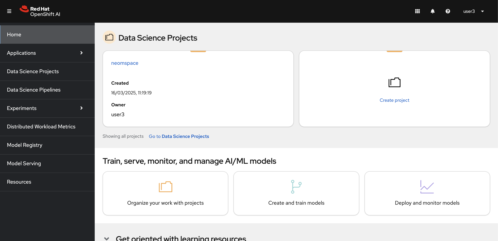
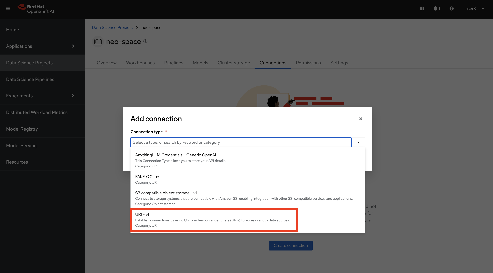
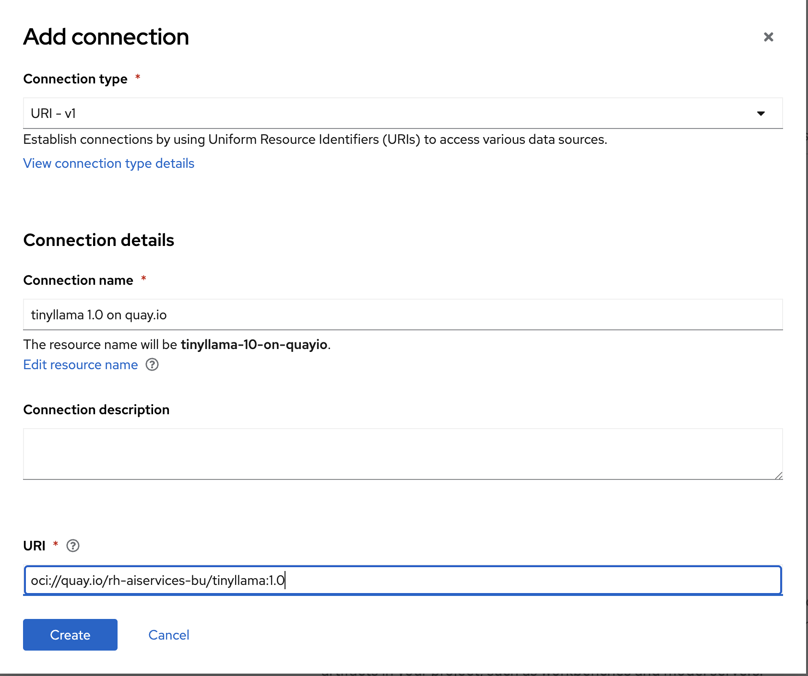
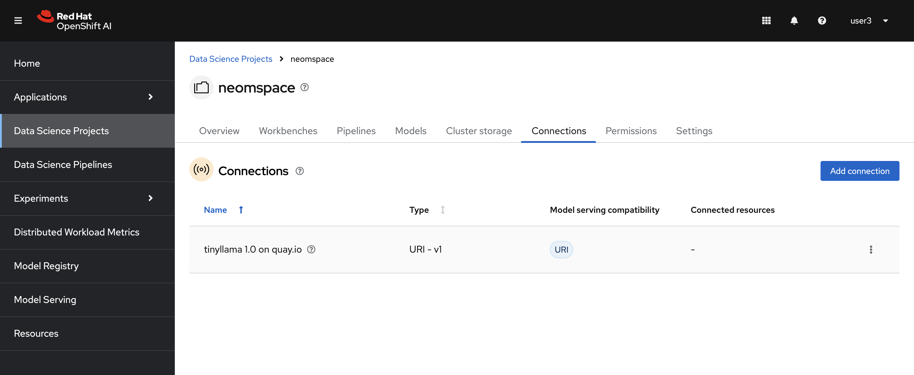
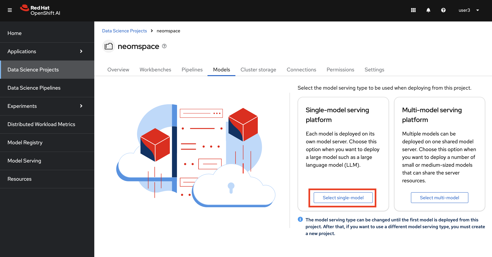
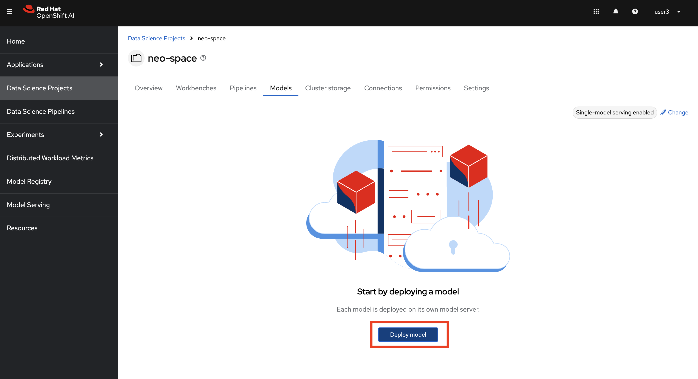
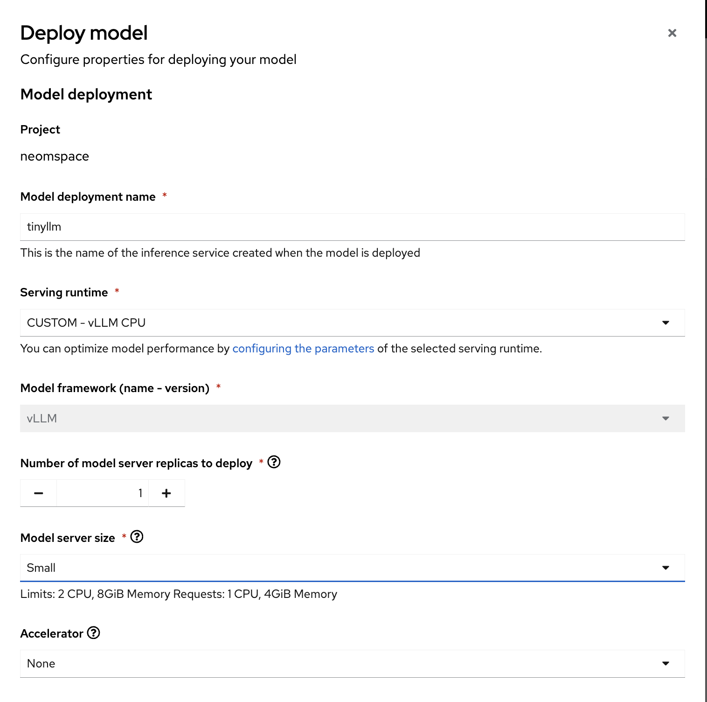
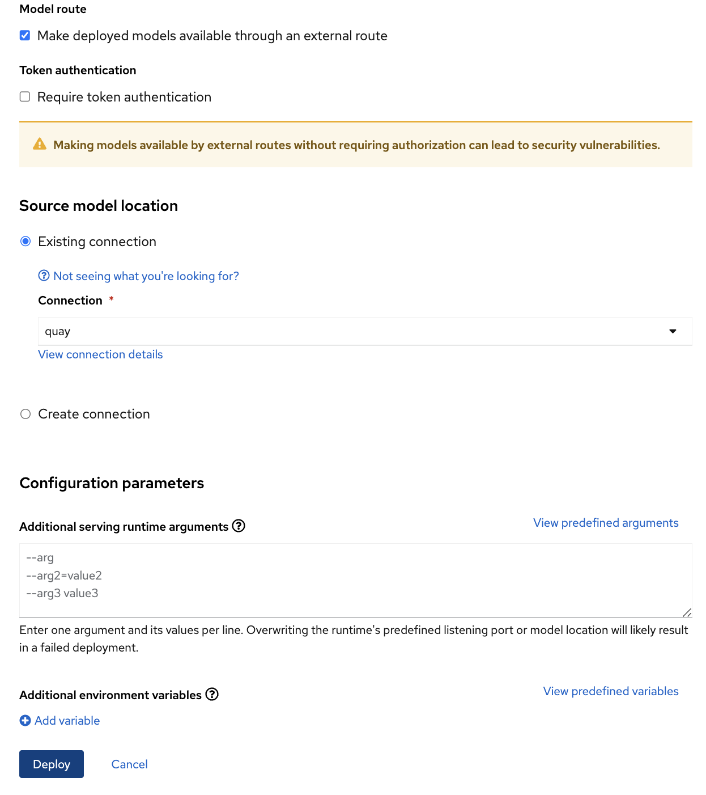
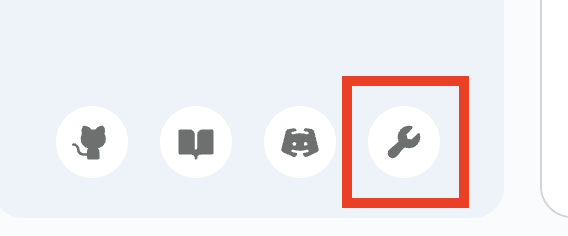
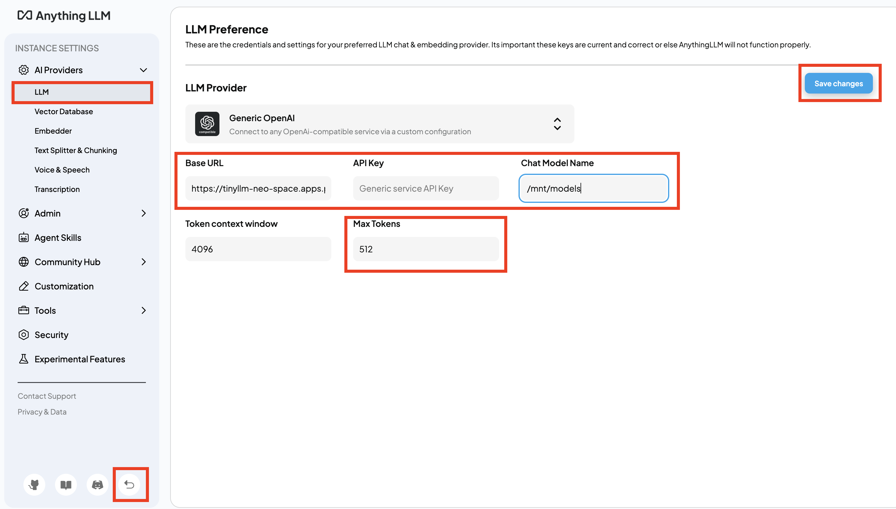

# 🚪 Red Hat AI Sparring Program - Yellow Belt

Welcome to the Level 4 - Yellow Belt. Let's start! 

1. Log in OpenShift AI [here](http://red.ht/rhoai-bu-cluster).

2. Find your Data Science Project.

    

## 💊 Create Connection

1. First, let’s create a connection that is pointing to our teeny tiiinny LLM 💚 In your Data Science Project, go to `Connections` , hit `Create Connection` and  select `URI - v1`.

    

2. Fill out the form with below information:

	**Name:** `tinyllama 1.0 on quay.io`

    **URI:** `oci://quay.io/rh-aiservices-bu/tinyllama:1.0`

    

    After you hit `Create`, you should see a screen like this:

    

## 🔴 Deploy the Tiny Model

1. Now,  let’s go to `Models`, and select `Single Model Serving` if you haven’t picked yet.

    

2. Then click `Deploy`.

    

3. Fill out the form as below:

    - **Model deployment name:** `tinyllm`

    - **Serving Runtime:** `CUSTOM - vLLM CPU`

   -  **Model Serving Size:** `Small`

    - **Model route:**
        - Select Make deployed models available through an external route
        - Uncheck `Require token authentication` for now

    - **Source Model Location:**

        - Select the Connection you just created: `tinyllama 1.0 on quay.io`
  
    ..leave the rest as it is and hit `Deploy`

    
    

    After a little waiting, you should get a ☘️Green☘️ status 🎉🎉

    Congratulation, you just deployed a tiny but mighty model!

## 🔵 re-Configure AnythingLLM

1. And now if you want to chat with your small but mighty model, all you need to do is make your AnythingLLM pointing to this model! G back to your AnythingLLM settings by clicking the below icon on the right bottom corner:

    

2. And Click `LLM`. Just replace the Granite endpoint URL with your TinyLLM endpoint URL:

    - **Base URL:** `<YOUR MODEL ENDPOINT>/v1`
  
      - For example: https://tinyllm-neo-space.apps.prod.mycluster.com/v1 (make sure you add **/v1** at the end.)

    - **API Key:** Please delete, it should be empty.

   -  **Chat Model Name:** `/mnt/models`

    Then **save changes**, and **go back**!

    

## 🕶️ Test YOUR Tiny LLM

Have a little chat with it (and never take the power of GPUs for granted again😅)
