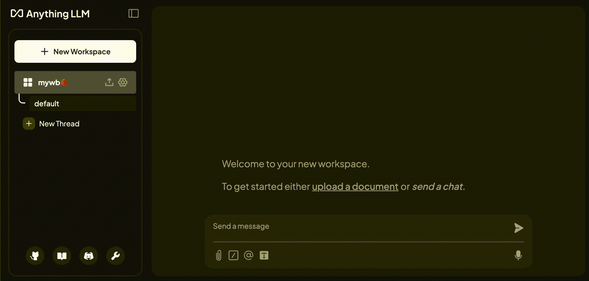

# 🚪 Red Hat AI Sparring Program - Yellow Belt

Welcome to the Level 4 - Yellow Belt. Let's start! 

1. Log in OpenShift AI [here](http://red.ht/rhoai-bu-cluster).

2. Find your Data Science Project and click it.

    

## 💊 Create Connection

1. First, let’s create a connection that is pointing to our teeny tiiinny LLM 💚 In your Data Science Project, go to `Connections` , hit `Create Connection` and select `URI - v1`.

    

2. Fill out the form with below information and click `Create`:

	**Name:** `tinyllama 1.0 on quay.io`

    **URI:** `oci://quay.io/rh-aiservices-bu/tinyllama:1.0`

    

    After you click `Create`, you should see a screen like this:

    

## 🔴 Deploy the Tiny Model

1. Now, let’s go to `Models`, and select `Single Model Serving` if you haven’t picked it yet.

    

2. Then click `Deploy`.

    

3. Fill out the form as below:

    - **Model deployment name:** `tinyllm`

    - **Serving Runtime:** `CUSTOM - vLLM CPU`

   -  **Model Serving Size:** `Small`

    - **Model route:**
        - Select `Make deployed models available through an external route`
        - **Uncheck** `Require token authentication`.

    - **Source Model Location:**

        - Select the Connection you just created: `tinyllama 1.0 on quay.io`
  
    ..leave the rest as it is and hit `Deploy`

    
    

    After a little waiting, you should get a ☘️Green☘️ status 🎉🎉

    Congratulation, you just deployed a tiny but mighty model!

## 🔵 re-Configure AnythingLLM

1. And now if you want to chat with your small but mighty model, all you need to do is to make your AnythingLLM pointing to it! First, let's copy the **external** endpoint of our model from `Models` page:

    

2. Then, please go back to your AnythingLLM. Go to its `settings` by clicking the below icon on the left bottom corner:

    

3. Click `AI Providers` >  `LLM`, and update the model information with your TinyLLM external endpoint that you just copied:

    - **Base URL:** `<YOUR-MODEL-EXTERNAL-ENDPOINT>/v1` 
  
      - For example: https://tinyllm-neomspace.apps.prod.mycluster.com/v1 (make sure you add **/v1** at the end‼️)

    - **API Key:** Please delete, it should be empty.

   -  **Chat Model Name:** `/mnt/models`

   -  **Max Tokens**: `512`

    Then **save changes**, and **go back**!

    

## 🕶️ Test YOUR Tiny LLM

1. Have a little chat with it (and never take the power of GPUs for granted again😅)

    

